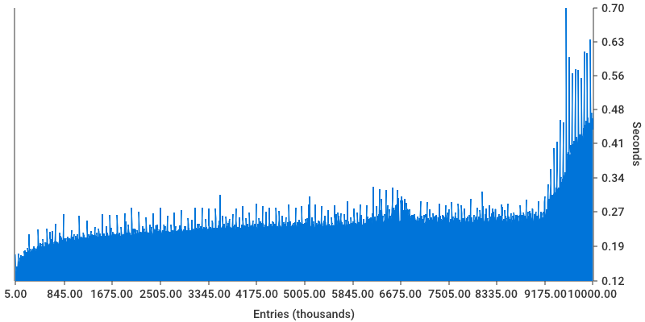
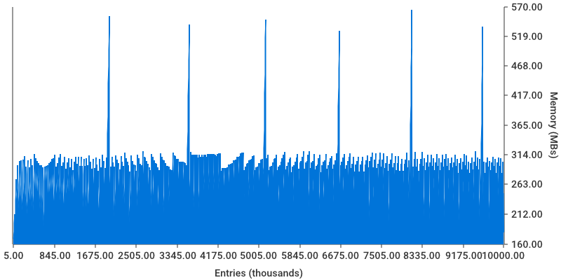

Base-2 merkelized trie, stored in files.
====================================================

**Work in progress**

Authenticated, versioned key value store. Aims to be faster then other existing stores implemented
on top of the leveldb/rocksdb (tendermint merkle iavl tree, ethereum patricia trie).
Implementation is based on the design proposed in [handshake whitepaper](https://handshake.org/files/handshake.txt), section `FFMT (Flat-File Merkle Tree)`.

Last benchmarks for commision of 5,000 leaves in batches, flushing each 1,000. Whole db size is 10,000,000 leaves.

Time spent for insertion:

Memory consumption:

